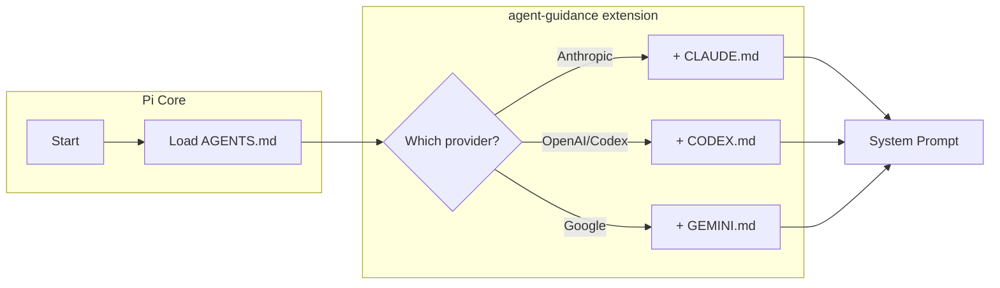

# agent-guidance

Loads different context files based on the current model's provider, supplementing Pi's core `AGENTS.md` loading with provider-specific additions.

## How It Works



**Files are loaded from:** `~/.pi/agent/` (global) and `project/` (local), walking up parent directories.

| Model Provider | Context File |
|---------------|--------------|
| Anthropic (Claude) | `CLAUDE.md` |
| OpenAI / Codex | `CODEX.md` |
| Google (Gemini) | `GEMINI.md` |

## Install

```bash
./setup.sh
```

This symlinks:
- Template context files to `~/.pi/agent/`
- The extension to `~/.pi/agent/extensions/`

Edit files in `templates/` to customize your guidelines.

## Configuration (Optional)

Create `~/.pi/agent/provider-context.json` to customize mappings:

```json
{
  "providers": {
    "anthropic": ["CLAUDE.md"],
    "openai": ["CODEX.md", "OPENAI.md"]
  },
  "models": {
    "claude-3-5-sonnet*": ["CLAUDE-3-5.md"],
    "o1*": ["O1.md"]
  }
}
```

## Templates

- `templates/AGENTS.md` - Universal guidelines for all models
- `templates/CLAUDE.md` - Claude-specific guidelines
- `templates/CODEX.md` - OpenAI/Codex guidelines (adapted from [steipete/agent-scripts](https://github.com/steipete/agent-scripts))
- `templates/GEMINI.md` - Gemini-specific guidelines
