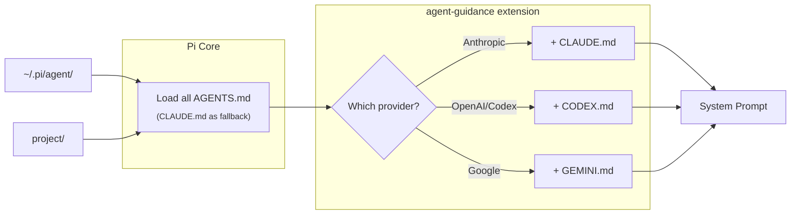

# agent-guidance

Loads provider-specific context files (CLAUDE.md, CODEX.md, GEMINI.md) based on current model, supplementing Pi's AGENTS.md loading.

## How It Works



| Provider | File |
|----------|------|
| Anthropic | CLAUDE.md |
| OpenAI / Codex | CODEX.md |
| Google | GEMINI.md |

### Pi Core behavior

Pi Core loads `AGENTS.md` from `~/.pi/agent/` and project directories (walking up from cwd). Falls back to `CLAUDE.md` if no `AGENTS.md` exists.

### What this extension adds

For each directory, loads the provider-specific file if:
- `AGENTS.md` exists (so core didn't load the provider file as fallback)
- Content differs from `AGENTS.md` (handles copy scenario)

## Install

### Pi package manager

```bash
pi install npm:@tmustier/pi-agent-guidance
```

```bash
pi install git:github.com/tmustier/pi-extensions
```

Then filter to just this extension in `~/.pi/agent/settings.json`:

```json
{
  "packages": [
    {
      "source": "git:github.com/tmustier/pi-extensions",
      "extensions": ["agent-guidance/agent-guidance.ts"]
    }
  ]
}
```

### Local clone (setup script)

```bash
./setup.sh
```

Links the extension to `~/.pi/agent/extensions/` and helps you set up `AGENTS.md`.

## Templates

Starter templates in `templates/`:
- `CLAUDE.md` - Claude-specific guidelines
- `CODEX.md` - OpenAI guidelines (from [steipete/agent-scripts](https://github.com/steipete/agent-scripts))
- `GEMINI.md` - Gemini guidelines

Install with:
```bash
ln -s ~/pi-extensions/agent-guidance/templates/CLAUDE.md ~/.pi/agent/
```

## Configuration (Optional)

Create `~/.pi/agent/agent-guidance.json`:

```json
{
  "providers": { "anthropic": ["CLAUDE.md"] },
  "models": { "claude-3-5*": ["CLAUDE-3-5.md"] }
}
```

## Changelog

See `CHANGELOG.md`.
