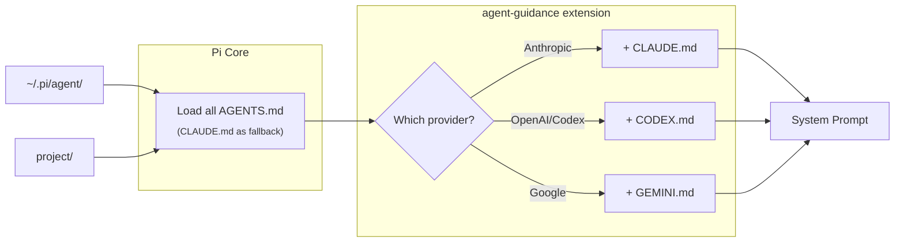

# agent-guidance

Loads different context files based on the current model's provider, supplementing Pi's core `AGENTS.md` loading with provider-specific additions.

## How It Works



**Files are loaded from:** `~/.pi/agent/` (global) and `project/` (local), walking up parent directories.

| Model Provider | Context File |
|---------------|--------------|
| Anthropic (Claude) | `CLAUDE.md` |
| OpenAI / Codex | `CODEX.md` |
| Google (Gemini) | `GEMINI.md` |

### Currently, the existing Pi Core:

1. Starts at `~/.pi/agent/` (global)
2. Walks up from cwd to root, collecting each directory
3. For **each directory**, looks for `AGENTS.md` first, falls back to `CLAUDE.md`
4. Returns all found files in order (global → root → cwd)

So the existing Pi Core loads:
```
~/.pi/agent/AGENTS.md     (global)
/some/parent/AGENTS.md    (if exists in parent dirs)
./AGENTS.md               (project)
```

If any directory has no `AGENTS.md` but has `CLAUDE.md`, it loads `CLAUDE.md` as fallback for that directory.

### What agent-guidance adds:

1. Checks current model's provider
2. Walks the same directories (global + ancestors)
3. For each directory:
   - If `AGENTS.md` exists → core loaded it → extension adds provider file (CLAUDE.md/CODEX.md/GEMINI.md)
   - If only `CLAUDE.md` exists → core already loaded it → extension **skips** CLAUDE.md (avoids duplicate) but still loads CODEX.md for OpenAI

**Example with Anthropic model:**
```
~/.pi/agent/AGENTS.md     ← Core
~/.pi/agent/CLAUDE.md     ← Extension adds
./AGENTS.md               ← Core  
./CLAUDE.md               ← Extension adds
```

**Example with OpenAI model:**
```
~/.pi/agent/AGENTS.md     ← Core
~/.pi/agent/CODEX.md      ← Extension adds
./AGENTS.md               ← Core
```

## Install

```bash
./setup.sh
```

This symlinks:
- Template context files to `~/.pi/agent/`
- The extension to `~/.pi/agent/extensions/`

Edit files in `templates/` to customize your guidelines.

## Configuration (Optional)

Create `~/.pi/agent/provider-context.json` to customize mappings:

```json
{
  "providers": {
    "anthropic": ["CLAUDE.md"],
    "openai": ["CODEX.md", "OPENAI.md"]
  },
  "models": {
    "claude-3-5-sonnet*": ["CLAUDE-3-5.md"],
    "o1*": ["O1.md"]
  }
}
```

## Templates

- `templates/CLAUDE.md` - Claude-specific guidelines
- `templates/CODEX.md` - OpenAI/Codex guidelines (adapted from [steipete/agent-scripts](https://github.com/steipete/agent-scripts))
- `templates/GEMINI.md` - Gemini-specific guidelines

Note: `AGENTS.md` is not included - that's your own config that Pi Core loads. This extension only adds provider-specific files on top.
