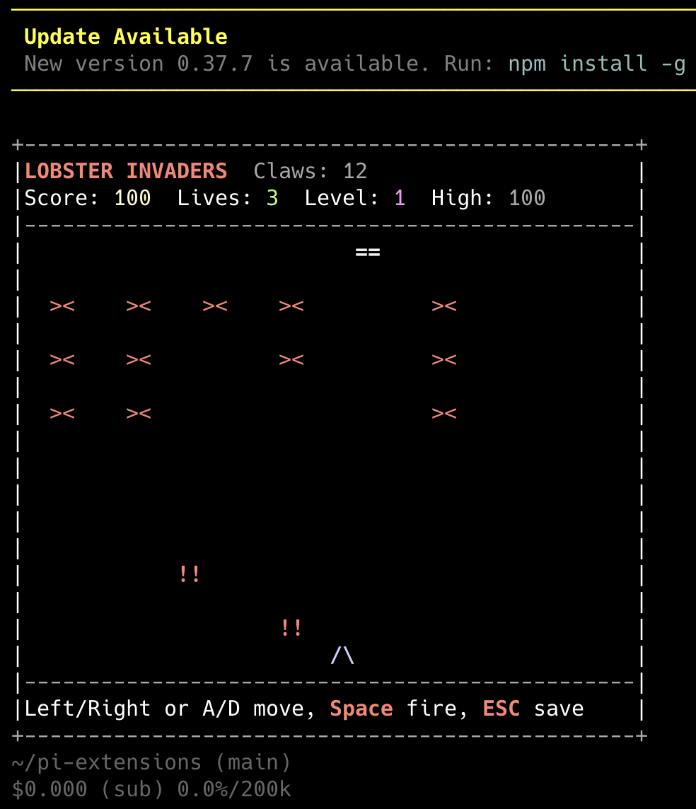
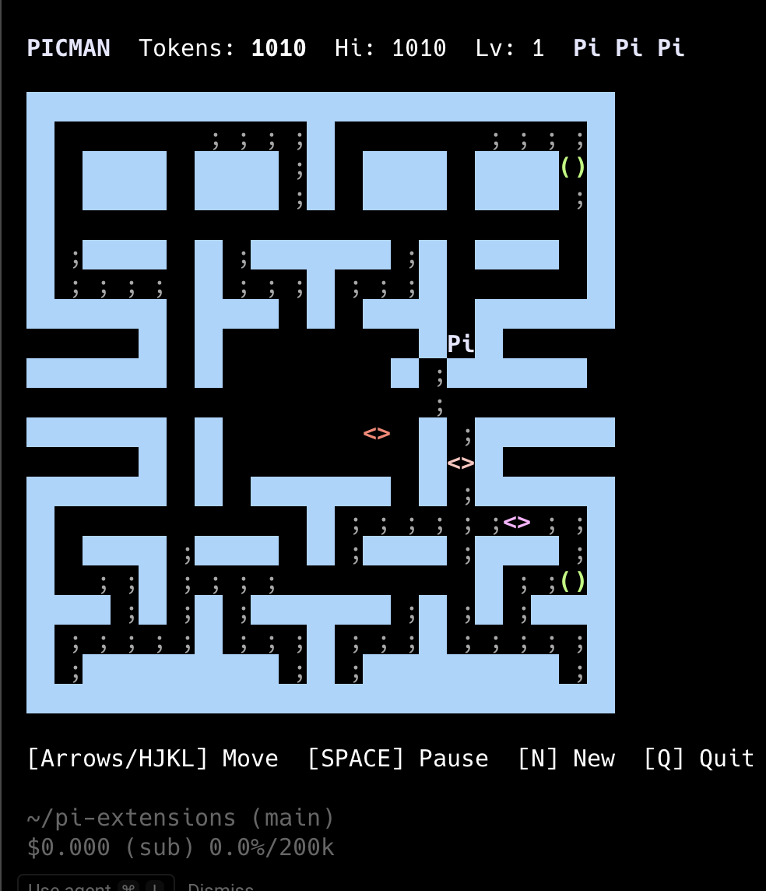
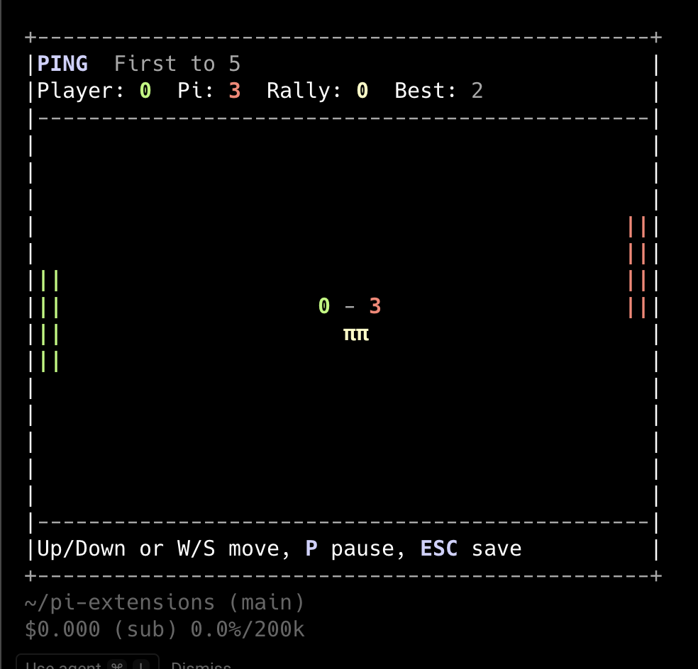
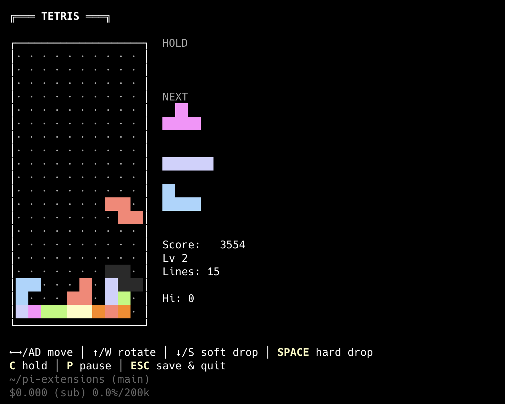

# arcade

[**▶️ Watch demo**](assets/demo.mp4)

[Snake](https://github.com/badlogic/pi-mono/blob/main/packages/coding-agent/examples/extensions/snake.ts) is cool, but have you tried:

- **sPIce-invaders** (`/spice-invaders`) - type `clawd` for a special challenge that gets harder every level
- **picman** (`/picman`)
- **ping** (`/ping`) - in a similar vein to [patriceckhart's](https://github.com/patriceckhart/pi-ng-pong)
- **tetris** (`/tetris`)
- **mario-not** (`/mario-not`) - Mario-style platformer (experimental)

<table>
  <tr>
    <td></td>
    <td></td>
  </tr>
  <tr>
    <td></td>
    <td></td>
  </tr>
</table>

## Install

### Pi package manager

```bash
pi install npm:@tmustier/pi-arcade
```

```bash
pi install git:github.com/tmustier/pi-extensions
```

Then filter to just the games in `~/.pi/agent/settings.json`:

```json
{
  "packages": [
    {
      "source": "git:github.com/tmustier/pi-extensions",
      "extensions": [
        "arcade/spice-invaders.ts",
        "arcade/picman.ts",
        "arcade/ping.ts",
        "arcade/tetris.ts",
        "arcade/mario-not/mario-not.ts"
      ]
    }
  ]
}
```

### Local clone

```bash
# All games
ln -s ~/pi-extensions/arcade/*.ts ~/.pi/agent/extensions/
ln -s ~/pi-extensions/arcade/mario-not/mario-not.ts ~/.pi/agent/extensions/

# Or individual games
ln -s ~/pi-extensions/arcade/spice-invaders.ts ~/.pi/agent/extensions/
ln -s ~/pi-extensions/arcade/picman.ts ~/.pi/agent/extensions/
ln -s ~/pi-extensions/arcade/ping.ts ~/.pi/agent/extensions/
ln -s ~/pi-extensions/arcade/tetris.ts ~/.pi/agent/extensions/
ln -s ~/pi-extensions/arcade/mario-not/mario-not.ts ~/.pi/agent/extensions/
```

Or add to `~/.pi/agent/settings.json`:

```json
{
  "extensions": [
    "~/pi-extensions/arcade/spice-invaders.ts",
    "~/pi-extensions/arcade/picman.ts",
    "~/pi-extensions/arcade/ping.ts",
    "~/pi-extensions/arcade/tetris.ts",
    "~/pi-extensions/arcade/mario-not/mario-not.ts"
  ]
}
```

## Changelog

See `CHANGELOG.md`.

