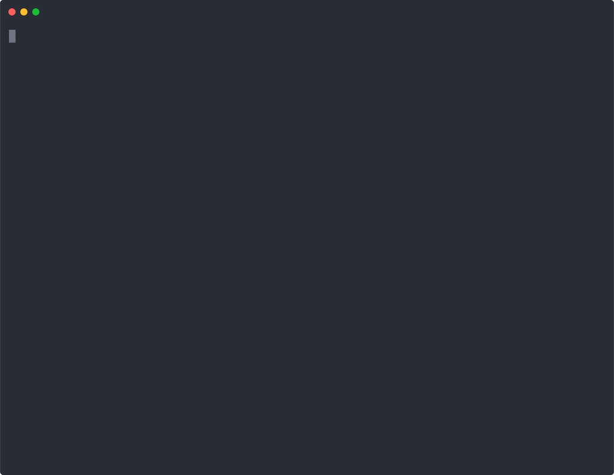

# files-widget

In-terminal file browser and viewer for Pi. Navigate files, view diffs, select code, and send comments to the agent without leaving the terminal.



## Install

**Quick install (Pi package manager):**

```bash
pi install npm:@tmustier/pi-files-widget
```

```bash
pi install git:github.com/tmustier/pi-extensions
```

Then add to `~/.pi/agent/settings.json`:

```json
{
  "packages": [
    {
      "source": "git:github.com/tmustier/pi-extensions",
      "extensions": ["files-widget/index.ts"]
    }
  ]
}
```

**Local clone:**

Add to your Pi extensions list:

```json
{
  "extensions": [
    "~/pi-extensions/files-widget"
  ]
}
```

If you prefer symlinking into `~/.pi/agent/extensions`:

```bash
ln -sfn ~/pi-extensions/files-widget ~/.pi/agent/extensions/files-widget
```

Then reference it in your settings:

```json
{
  "extensions": [
    "~/.pi/agent/extensions/files-widget"
  ]
}
```

## Dependencies (recommended)

```bash
brew install bat git-delta glow
```

- `bat`: syntax highlighting
- `delta`: formatted diffs
- `glow`: markdown rendering

If any are missing, the extension will notify you at session start and gracefully fall back to plain rendering.

## Commands

- `/files` - open the file browser
- `/review` - open tuicr review flow
- `/diff` - open critique (bunx critique)

### Review/Diff Dependencies

```bash
brew install agavra/tap/tuicr
brew install oven-sh/bun/bun
```

- `tuicr` is required for `/review`
- `bun` is required for `/diff`

If missing, `/review` or `/diff` will show a clear install prompt.

## Browser Keybindings

- `j/k` or `↑/↓`: move
- `Enter`: open file / expand folder
- `h/l` or `←/→`: collapse/expand folder
- `PgUp/PgDn`: page up/down
- `c`: toggle changed-only view
- `]` / `[`: next/prev changed file
- `/`: search (type to filter, `Esc` to exit)
- `+` / `-`: increase/decrease browser height
- `q`: close

## Viewer Keybindings

- `j/k` or `↑/↓`: scroll
- `PgUp/PgDn`: page up/down
- `g/G`: top/bottom
- `d`: toggle diff (tracked files only)
- `/`: search (type to search)
- `n` / `N`: next/prev match
- `v`: select mode (line selection)
- `c`: comment on selected lines (inline prompt)
- `]` / `[`: next/prev changed file
- `+` / `-`: increase/decrease viewer height
- `q`: back to browser

## Notes

- Untracked files show as `[UNTRACKED]` and open in normal view.
- Folder LOCs are shown only when the folder is collapsed (expanded folders would duplicate counts).
- Line counts load asynchronously; the header shows activity while counts are computed.
- Large non-git folders load progressively and may show `[partial]` while loading in safe mode.
- Git status refreshes every 3 seconds while `/files` is open.
