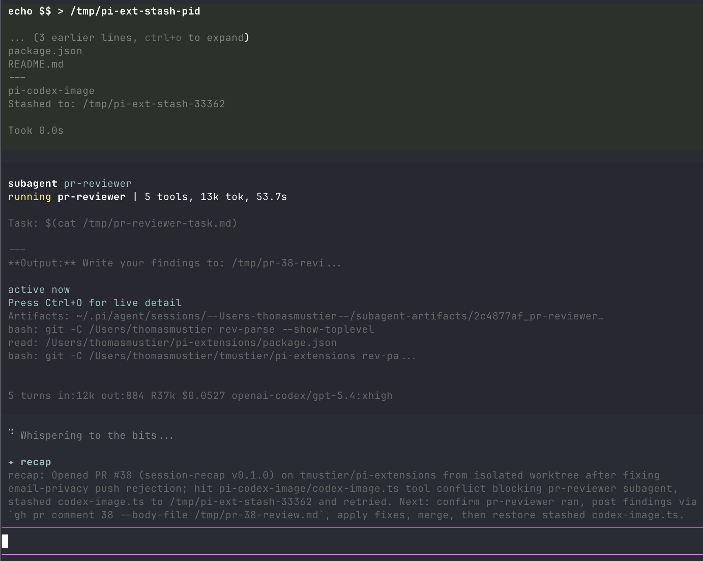

# session-recap

Claude-Code-style session recap for Pi. When you switch focus away from a Pi session and come back, a one-line recap appears above the editor so you can re-enter flow without re-reading scrollback.



Built for multi-clauding / multi-pi workflows where several agent sessions run in parallel tabs.

## How it triggers

Two complementary triggers. You get whichever fires first.

1. **Terminal focus reporting (DECSET `?1004`).** The extension enables focus events on session start and listens for `ESC[O` (focus-out) and `ESC[I` (focus-in). On focus-out it drafts a recap in the background; on focus-in it reveals the recap above the editor, as long as you were away for at least `--recap-focus-min-seconds` (default 3s — suppresses quick glances).
2. **Idle fallback.** After the last `turn_end`, if you don't type for `--recap-idle-seconds` (default 45s), the recap is generated and shown anyway. This covers terminals that don't report focus events.

Also fires automatically on `/resume` and `/fork` so you know where the prior session left off.

Clears cleanly on: next user input, new turn start, session reload, or session shutdown.

## Terminal compatibility

| Terminal | Focus reporting | Notes |
|---|---|---|
| iTerm2, Ghostty, Alacritty, Kitty, WezTerm, xterm | ✅ | Works out of the box. |
| VS Code integrated terminal, Warp | ✅ | Works. |
| Apple Terminal | ⚠️ Partial | Idle fallback covers it. |
| tmux | ✅ (with config) | Add `set -g focus-events on` to `~/.tmux.conf`, then `tmux source-file ~/.tmux.conf`. |

If focus events cause any weirdness in your terminal, run with `--recap-disable-focus` and the idle fallback still works.

## Model

Defaults to the **currently active model** in your Pi session, but with recap-specific low-cost settings. This piggybacks on whatever auth you already have (including custom providers registered via `pi.registerProvider`), so there are no login surprises.

- No tools or Agent Skills are loaded into the recap call — only the compact transcript below is sent.
- Reasoning/thinking is disabled for the recap call.
- Prompt cache writes/reads are disabled with `cacheRetention: "none"`.
- Output is capped with `maxTokens: 256`.
- No active model or missing API key → the recap is skipped silently.

Override with `--recap-model "<provider>/<id>"` if you want a specific model regardless of the session's active one.

## Install

### Pi package manager

```bash
pi install git:github.com/tmustier/pi-extensions
```

Filter to just this extension in `~/.pi/agent/settings.json`:

```json
{
  "packages": [
    {
      "source": "git:github.com/tmustier/pi-extensions",
      "extensions": ["session-recap/index.ts"]
    }
  ]
}
```

### Local clone

```json
{
  "extensions": [
    "~/pi-extensions/session-recap/index.ts"
  ]
}
```

## Flags

| Flag | Default | Description |
|---|---|---|
| `--recap-idle-seconds <n>` | `45` | Seconds after `turn_end` before the idle-fallback recap fires. |
| `--recap-focus-min-seconds <n>` | `3` | Minimum focus-out duration before a recap is revealed on refocus. |
| `--recap-disable-focus` | `false` | Disable DECSET `?1004` focus reporting. Idle fallback still runs. |
| `--recap-during-active` | `false` | Allow focus-triggered recaps while an agent turn is still running. This restores the older “peek mid-flight” behavior, at the cost of possible stale/discarded duplicate drafts. |
| `--recap-disable` | `false` | Disable the automatic recap entirely. `/recap` still works. |
| `--recap-model "<p/id>"` | (active model) | Override the default, e.g. `anthropic/claude-sonnet-4-6`. |

## Command

| Command | Description |
|---|---|
| `/recap` | Force-generate a recap right now, bypassing the activity gate. |

## Behaviour notes

- **Uses `turn_end`, not `agent_end`**, so a turn that errors or is aborted still gets recapped.
- **No duplicate drafts**: the last-drafted branch-leaf is stamped; if you focus out / in repeatedly without any new session activity, the recap is reused rather than regenerated.
- **Defers during active work by default**: if you focus away during a slow model/tool action, the focus recap waits until the agent finishes loading before drafting, matching Claude Code's away-summary behavior. Use `--recap-during-active` to allow mid-flight recaps instead.
- **Aborts on new input**: any in-flight recap request is cancelled when you start typing or a new turn begins.
- **No session persistence**: the recap lives only in the widget for the active session — nothing is stored.

## Design

See [DESIGN.md](./DESIGN.md) for the design-of-record and open questions.

## License

MIT
