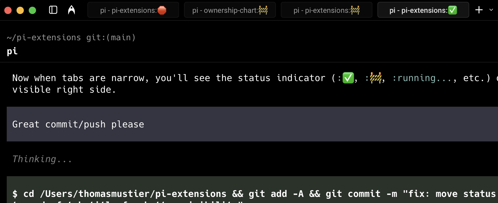

# tab-status

Manage as many parallel Pis as your mind can handle without forgetting any of them.

Adds little modifiable indicators to tab titles:
- ✅ means done and committed
- 🚧 means done without a commit - Pi might need you to answer a question
- 🛑 means the agent is blocked (no messages or tool calls for 180s while running) or stopped due to an error
- `running...` means agent turn in progress - you can check back later

The more tabs you have open, the better it is.



## Install

```bash
ln -s ~/pi-extensions/tab-status/tab-status.ts ~/.pi/agent/extensions/
```

Or add to `~/.pi/agent/settings.json`:

```json
{
  "extensions": ["~/pi-extensions/tab-status/tab-status.ts"]
}
```

## Todo

- [x] Status indicators in terminal tabs
- [ ] Central location to view and navigate to specific tabs across terminal windows
