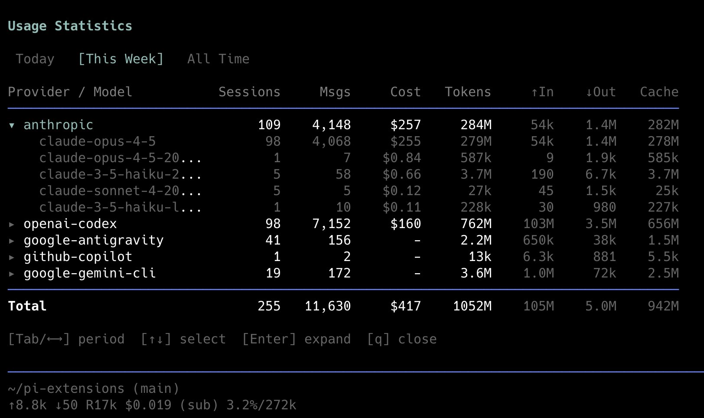

# /usage - Usage Statistics Dashboard

A Pi extension that displays aggregated usage statistics across all sessions.



## Compatibility

- **Pi version:** 0.42.4+
- **Last updated:** 2026-01-10

## Installation

Add to your `~/.pi/agent/settings.json`:

```json
{
  "extensions": [
    "~/pi-extensions/usage-extension"
  ]
}
```

## Usage

In Pi, run:
```
/usage
```

## Features

### Time Periods

| Period | Definition |
|--------|------------|
| **Today** | From midnight (00:00) today |
| **This Week** | From Monday 00:00 of the current week |
| **All Time** | All recorded sessions |

Use `Tab` or `←`/`→` to switch between periods.

### Columns

| Column | Description |
|--------|-------------|
| **Provider / Model** | Provider name, expandable to show models |
| **Sessions** | Number of unique sessions |
| **Msgs** | Number of assistant messages |
| **Cost** | Total cost in USD (from API response) |
| **Tokens** | Total tokens (input + output + cache) |
| **↑In** | Input tokens *(dimmed)* |
| **↓Out** | Output tokens *(dimmed)* |
| **Cache** | Cache read + write tokens *(dimmed)* |

### Navigation

| Key | Action |
|-----|--------|
| `Tab` / `←` `→` | Switch time period |
| `↑` `↓` | Select provider |
| `Enter` / `Space` | Expand/collapse provider to show models |
| `q` / `Esc` | Close |

## Provider Notes

### Cost Tracking

Cost data comes directly from the API response (`usage.cost.total`). Accuracy depends on the provider reporting costs.

### Cache Tokens

Cache token support varies by provider:

| Provider | Cache Read | Cache Write |
|----------|------------|-------------|
| Anthropic | ✓ | ✓ |
| Google | ✓ | ✗ |
| OpenAI Codex | ✓ | ✗ |

The "Cache" column combines both read and write tokens.

## Data Source

Statistics are parsed from session files in `~/.pi/agent/sessions/`. Each session is a JSONL file containing message entries with usage data.

Respects the `PI_CODING_AGENT_DIR` environment variable if set.

## Changelog

### 2026-01-10
- Initial release
- Collapsible provider/model view
- Three time periods: Today, This Week, All Time
- Token breakdown columns (dimmed for de-emphasis)
