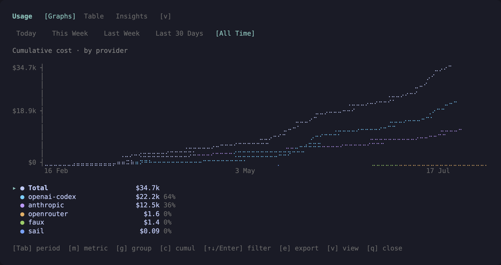

# /usage - Usage Statistics Dashboard

A Pi extension that displays aggregated usage statistics across all sessions.



## Compatibility

- **Pi version:** 0.42.4+
- **Last updated:** 2026-07-22 (0.9.3)

Pi 0.81.0+ can persist tool-result, compaction, and branch-summary usage. `/usage` includes that auxiliary usage in totals under `Tools / summaries`. Nested-agent reports are reconciled against recursively scanned child sessions, so a child call is counted once; when only part of an aggregate is already present, only the unmatched residual is added. Older Pi versions remain supported.

## Installation

### Pi package manager

```bash
pi install npm:@tmustier/pi-usage-extension
```

```bash
pi install git:github.com/tmustier/pi-extensions
```

Then filter to just this extension in `~/.pi/agent/settings.json`:

```json
{
  "packages": [
    {
      "source": "git:github.com/tmustier/pi-extensions",
      "extensions": ["usage-extension/index.ts"]
    }
  ]
}
```

### Local clone

Add to your `~/.pi/agent/settings.json`:

```json
{
  "extensions": [
    "~/pi-extensions/usage-extension"
  ]
}
```

## Usage

In Pi, run:
```
/usage
```

## Features

### Views

`/usage` has three view modes, shown as a tab strip in the title and cycled with `v`:

- **Graphs** (default) — an interactive braille line-chart explorer for usage over time (screenshot at the top of this page, details below).
- **Table** — per-provider / per-model stats with cost and token breakdown, with keyboard filtering (details below).
- **Insights** — data-driven characteristics of your cost for the active time period (details below). Insights are **independent lenses**, not a breakdown, so they overlap and don't sum to 100%.

Every view can export its current slice with `e` — see [Export](#export).


### Filtering the table

- `/` opens a live type-to-filter over provider **and** model names (case-insensitive substring). When only models match, the provider row is recomputed from just the matching models — filtering `sol` shows openai-codex as exactly its `gpt-5.6-sol` numbers. `Enter` keeps the filter, `Esc` clears it.
- `x` hides the selected provider row; `a` resets all hides and the filter.
- The **Total row recomputes over the visible slice**, and a status line makes the cut explicit so a filtered table can't be mistaken for the full period.


### Insights

The **Insights** view has two sections, facts first:

**Where it went** — always-on structural lenses:

| Insight | Detail |
|---|---|
| Tool and summary usage | share of cost reported by nested tool calls, compaction, and branch summarization (Pi 0.81.0+) |
| Context tax | share of cost spent at ≥ 150k context, with the average per-message cost vs messages under 100k |
| Project mix | top 3 project directories by cost, derived from each session's working directory (worktrees collapse into their repository; hidden when one project is ≥ 90% — you already know) |
| Reasoning share | share of output tokens that were hidden reasoning (recorded by pi 0.80.3+ only; hidden below 5%) |
| Burn trend | your last 7 days of spend vs your prior 4-week weekly pace (same on every tab) |

**Worth attention** — alarms that only appear when a wasteful pattern is material for the period. When nothing is flagged, the section shows an explicit all-clear. Large-context cache misses are split into three distinct behaviours:

| Alarm | Fires when |
|---|---|
| Resuming after a break | ≥ 2% of the period's cost (and ≥ $1) went to messages that re-sent a large conversation from scratch after a > 5 min idle gap — provider caches expire after a few minutes idle |
| Switching models mid-conversation | ≥ 2% of cost (and ≥ $1) went to large-context misses right after the provider/model changed mid-session — the previous model's cache doesn't transfer |
| Mid-session re-sends (prefix change) | ≥ 2% of cost (and ≥ $1) went to large-context misses with **no** idle gap, compaction, or model switch to explain them — something rewrote the request prefix |
| Session concentration | the top 5 sessions account for ≥ 35% of the period's cost |
| Upfront tax | ≥ 8% of cost was the first message of a session (session starts pay for their whole prompt uncached) |
| Cache leverage floor | fewer than 5 cached tokens served per fresh token paid (shown only above $5 / 1M fresh tokens, to avoid noise) |

pi's built-in test providers (`faux-provider`, `fake-provider`) never call a real API and are excluded from all statistics, graphs, and insights.

**Unit:** insights are weighted by recorded API cost (USD). Periods with no recorded cost show an explicit empty state rather than silently switching to a different unit.

A note on reading them: cache-miss and context numbers are **observed cost, not promised savings** — big-context messages often do bigger work. Treat the alarms as "look here", not as an invoice for waste.

### Export

Press `e` in any view to write the **current slice** to `/tmp` (or the OS temp dir where `/tmp` doesn't exist) — exports never litter your repo or home directory, and the `✓ Saved` note shows the full path so you can grab the file if you want to keep it:

| View | File | Contents |
|---|---|---|
| Table | `usage-table-<period>[-filtered]-<stamp>.csv` | per-model rows + TOTAL, full precision; honors the active filter/hides |
| Graphs | `usage-graph-<period>-<slice>-<stamp>.csv` | exactly what's plotted: visible series only, current metric/grouping/cumulative, ISO bucket starts |
| Insights | `usage-insights-<period>-<stamp>.json` | period, totals, and the structured insight list |

A `✓ Saved …` note confirms the write (or reports the error) above the help line.

To export somewhere permanent instead, set an export directory in `~/.pi/agent/settings.json` (created if missing, `~` expands):

```json
{
	"usage-extension": { "exportDir": "~/Downloads" }
}
```

### Graph explorer

The **Graphs** view plots usage over time for the active period as a braille line chart, with a legend showing per-series totals and shares.

- **Metric** (`m` to cycle): cost, tokens (input + output + cache write), messages, reasoning tokens.
- **Grouping** (`g` to cycle): by provider, by model, by thinking level, or total only. The top 6 series are shown individually; the rest merge into an `other` series. A bold **Total** line is always drawn.
- **Cumulative vs per-bucket** (`c` to toggle): running total across the period (default), or the raw per-bucket rate.
- **Filtering**: move the legend cursor with `↑`/`↓` and toggle series visibility with `Enter`/`Space` (`a` shows all again). The y-axis rescales to the visible series — hide the big lines to zoom into the small ones.
- **Buckets**: hourly for Today / This Week / Last Week, daily for Last 30 Days / All Time.
- **Line clipping**: every series (provider, model, thinking level, `other`, Total) is drawn only between its first and last bucket with usage, so late-starting or retired series don't drag a flat zero/flat tail across the whole period.

Thinking levels are replayed from `thinking_level_change` entries in each session file; messages before the first recorded change appear as `unknown`. Auxiliary usage has no reliable thinking-level attribution and appears as `Tools/summaries` in that grouping. Reasoning token counts come from `usage.reasoning` where providers report them; pi only records this field since **pi 0.80.3 (30 June 2026)**, so earlier sessions show zero reasoning tokens even though thinking models were in use.

### Time Periods

| Period | Definition |
|--------|------------|
| **Today** | From midnight (00:00) today |
| **This Week** | From Monday 00:00 of the current week |
| **Last Week** | Previous week (Monday 00:00 → this Monday 00:00) |
| **Last 30 Days** | Rolling window: the last 30 calendar days including today (from midnight 29 days back) |
| **All Time** | All recorded sessions |

Use `Tab` or `←`/`→` to switch between periods.

### Timezone

Time periods are calculated in the local timezone where Pi runs. If you want to override it, set the `TZ` environment variable (IANA timezone, e.g. `TZ=UTC` or `TZ=America/New_York`) before launching Pi.

### Columns

| Column | Description |
|--------|-------------|
| **Provider / Model** | Provider name, expandable to show models |
| **Sessions** | Number of unique sessions |
| **Msgs** | Number of assistant messages; auxiliary `Tools / summaries` usage does not inflate this count |
| **Cost** | Total cost in USD (from API response), including usage reported by tools and summaries |
| **Tokens** | Fresh tokens for the turn: input + output + cache write |
| **↑In** | Fresh input tokens: input + cache write *(dimmed)* |
| **↓Out** | Output tokens *(dimmed)* |
| **Cache** | Cache read + write tokens *(dimmed; informational)* |

> **As of 0.2.0:** `Tokens = Input + Output + CacheWrite` and `↑In = Input + CacheWrite`. `CacheRead` stays out of `Tokens` so repeated cache hits don't swamp the dashboard. The dashboard itself shows a one-line footer reminder.

On narrow terminals, `/usage` automatically switches to a compact table instead of overflowing the terminal. Hidden columns reappear as soon as you widen the terminal.

### Navigation

| Key | Action |
|-----|--------|
| `Tab` / `←` `→` | Switch time period |
| `↑` `↓` | Select provider *(table)* / move legend cursor *(graphs)* |
| `Enter` / `Space` | Expand/collapse provider *(table)* / toggle series visibility *(graphs)* |
| `v` | Cycle Graphs → Table → Insights view |
| `e` | Export the current slice to CSV/JSON |
| `/` | Type-to-filter providers and models *(table)* |
| `x` | Hide the selected provider row *(table)* |
| `m` | Cycle metric: cost / tokens / messages / reasoning *(graphs)* |
| `g` | Cycle grouping: provider / model / thinking level / total *(graphs)* |
| `c` | Toggle cumulative vs per-bucket *(graphs)* |
| `a` | Show all series *(graphs)* / reset filter and hides *(table)* |
| `q` / `Esc` | Close |

## Performance & Caching

`/usage` builds its stats from every session JSONL file under `<agentDir>/sessions`. To keep opens fast on large histories (multi-GB, thousands of files):

- **On-disk cache.** Per-file extraction results are cached in `<agentDir>/usage-extension-cache.json` (respects `PI_CODING_AGENT_DIR`), keyed by file size + mtime. Warm opens only re-parse session files that changed since the last run — on a 5.2 GB / 3,310-file corpus that takes the open from ~17 s to ~0.3 s.
- **First open** after install (or after deleting the cache) does a one-off full build, showing the usual cancellable loader. Cancelling saves partial progress, so the next open resumes where it left off.
- The cache is safe to delete at any time; it is rebuilt automatically. Corrupt or version-mismatched caches are ignored and rebuilt rather than trusted.
- **0.9.3 bumps the cache format to v5** to retain child-session linkage for tool-usage reconciliation (v4 added Pi 0.81.0 tool and summary usage; v3 added session working directory and compaction markers; v2 added thinking level and reasoning tokens). The first open after upgrading does a one-off full rebuild (with a progress message and live file counter), then warm opens are fast again.
- Large nested-agent tool results use an allocation-safe metadata parser: multi-megabyte output bodies are scanned as bytes rather than decoded and JSON-parsed in full.

## Provider Notes

### Cost Tracking

Cost data comes directly from persisted usage values. For assistant messages it is grouped by provider/model. Pi 0.81.0+ can also persist usage reported by tools, compaction, and branch summarization; because those entries do not carry reliable provider/model attribution, `/usage` groups them under `Tools / summaries`, matching Pi's `/session` breakdown. Recognised legacy `subagent` and `subagent_wait` details are used as a fallback when their child session is no longer available. Accuracy depends on the provider or tool reporting costs.

Only persisted usage can be counted. Pi did not add usage metadata retroactively, so historical compaction or branch-summary entries written without `usage` remain unmetered: their exact token and cost vectors cannot be reconstructed. The compatibility audit corpus contained 2,753 such compactions and 20 branch summaries.

### Cache Tokens

Cache token support varies by provider:

| Provider | Cache Read | Cache Write |
|----------|------------|-------------|
| Anthropic | ✓ | ✓ |
| Google | ✓ | ✗ |
| OpenAI Codex | ✓ | ✗ |

The "Cache" column combines both read and write tokens.

`Tokens` and `↑In` include cache writes but intentionally exclude cache reads. That keeps totals aligned with fresh/billed prompt work without letting repeated cache hits swamp the dashboard.

## Data Source

Statistics are parsed recursively from session files in `~/.pi/agent/sessions/`, including nested subagent runs such as `run-0/` directories. Each session is a JSONL file containing assistant messages and, on Pi 0.81.0+, optional usage on tool-result, compaction, and branch-summary entries.

Assistant messages duplicated across branched session files are deduplicated by timestamp + total tokens. Auxiliary usage is deduplicated by its stable session entry id, which avoids collapsing parallel tools that happen to report identical usage. Tool reports are reconciled globally across copied parent history: an exact contiguous child-session token-and-cost vector suppresses the matching portion of the parent aggregate, while missing children and unmatched residuals stay under `Tools / summaries`. Tool and summary usage contributes cost and tokens to totals, graphs, project/session mix, and burn trend, but does not count as an assistant message or distort conversation context/cache insights.

Respects the `PI_CODING_AGENT_DIR` environment variable if set.

## Changelog

See `CHANGELOG.md`.
