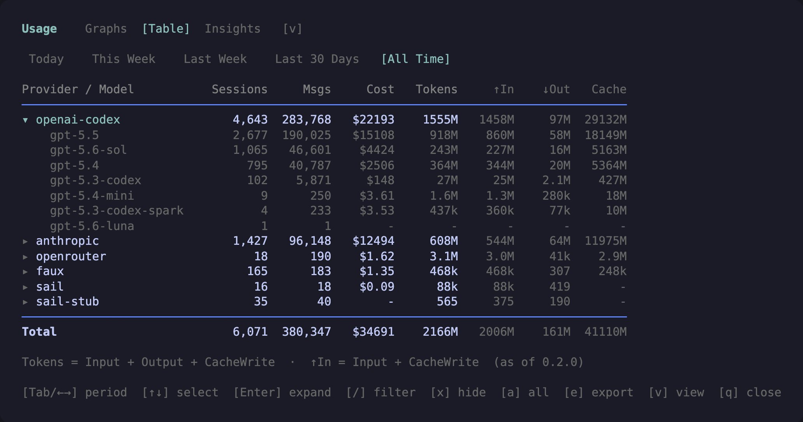
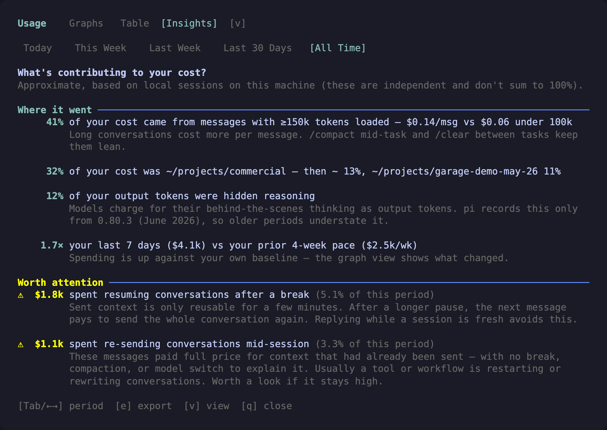

# /usage - Usage Statistics Dashboard

A Pi extension that displays aggregated usage statistics across all sessions.



## Compatibility

- **Pi version:** 0.42.4+
- **Last updated:** 2026-04-19 (0.3.1)

## Installation

### Pi package manager

```bash
pi install npm:@tmustier/pi-usage-extension
```

```bash
pi install git:github.com/tmustier/pi-extensions
```

Then filter to just this extension in `~/.pi/agent/settings.json`:

```json
{
  "packages": [
    {
      "source": "git:github.com/tmustier/pi-extensions",
      "extensions": ["usage-extension/index.ts"]
    }
  ]
}
```

### Local clone

Add to your `~/.pi/agent/settings.json`:

```json
{
  "extensions": [
    "~/pi-extensions/usage-extension"
  ]
}
```

## Usage

In Pi, run:
```
/usage
```

## Features

### Views

`/usage` has two view modes, toggled with `v`:

- **Table** (default) — per-provider / per-model stats with cost and token breakdown (screenshot at the top of this page).
- **Insights** — narrative characteristics of your cost for the active time period, e.g. *"X% of your cost was at >150k context"*. Insights are **independent characteristics**, not a breakdown, so they overlap and can sum to more than 100%.



**Unit:** insights are always weighted by recorded API cost (USD). Periods with no recorded cost show an explicit empty state rather than silently switching to a different unit.

The insights currently shown:

| Insight | Threshold |
|---|---|
| Parallel sessions | ≥ 4 sessions active within an exact ±2 min window |
| Large context | `input + cacheRead + cacheWrite > 150k` |
| Large uncached prompt | `input + cacheWrite > 100k` |
| Long-running sessions | session lifetime ≥ 8 hours (global, not per-period slice) |
| Top-session concentration | top 5 sessions by cost |

### Time Periods

| Period | Definition |
|--------|------------|
| **Today** | From midnight (00:00) today |
| **This Week** | From Monday 00:00 of the current week |
| **Last Week** | Previous week (Monday 00:00 → this Monday 00:00) |
| **All Time** | All recorded sessions |

Use `Tab` or `←`/`→` to switch between periods.

### Timezone

Time periods are calculated in the local timezone where Pi runs. If you want to override it, set the `TZ` environment variable (IANA timezone, e.g. `TZ=UTC` or `TZ=America/New_York`) before launching Pi.

### Columns

| Column | Description |
|--------|-------------|
| **Provider / Model** | Provider name, expandable to show models |
| **Sessions** | Number of unique sessions |
| **Msgs** | Number of assistant messages |
| **Cost** | Total cost in USD (from API response) |
| **Tokens** | Fresh tokens for the turn: input + output + cache write |
| **↑In** | Fresh input tokens: input + cache write *(dimmed)* |
| **↓Out** | Output tokens *(dimmed)* |
| **Cache** | Cache read + write tokens *(dimmed; informational)* |

> **As of 0.2.0:** `Tokens = Input + Output + CacheWrite` and `↑In = Input + CacheWrite`. `CacheRead` stays out of `Tokens` so repeated cache hits don't swamp the dashboard. The dashboard itself shows a one-line footer reminder.

On narrow terminals, `/usage` automatically switches to a compact table instead of overflowing the terminal. Hidden columns reappear as soon as you widen the terminal.

### Navigation

| Key | Action |
|-----|--------|
| `Tab` / `←` `→` | Switch time period |
| `↑` `↓` | Select provider *(table view)* |
| `Enter` / `Space` | Expand/collapse provider to show models *(table view)* |
| `v` | Toggle between Table and Insights view |
| `q` / `Esc` | Close |

## Provider Notes

### Cost Tracking

Cost data comes directly from the API response (`usage.cost.total`). Accuracy depends on the provider reporting costs.

### Cache Tokens

Cache token support varies by provider:

| Provider | Cache Read | Cache Write |
|----------|------------|-------------|
| Anthropic | ✓ | ✓ |
| Google | ✓ | ✗ |
| OpenAI Codex | ✓ | ✗ |

The "Cache" column combines both read and write tokens.

`Tokens` and `↑In` include cache writes but intentionally exclude cache reads. That keeps totals aligned with fresh/billed prompt work without letting repeated cache hits swamp the dashboard.

## Data Source

Statistics are parsed recursively from session files in `~/.pi/agent/sessions/`, including nested subagent runs such as `run-0/` directories. Each session is a JSONL file containing message entries with usage data.

Assistant messages duplicated across branched session files are deduplicated by timestamp + total tokens, matching the extension's previous behavior while still including recursive subagent sessions.

Respects the `PI_CODING_AGENT_DIR` environment variable if set.

## Changelog

See `CHANGELOG.md`.
